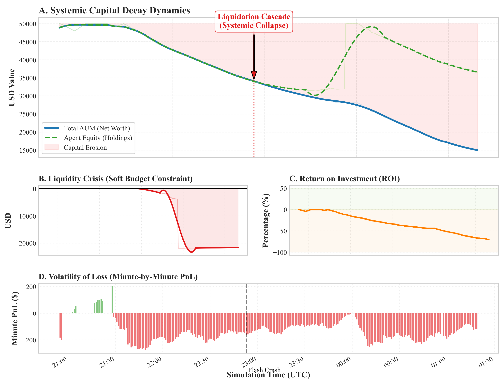

# 红皇后的陷阱：深度进化算法在高频交易中的局限性研究

[](https://opensource.org/licenses/MIT)
[](https://www.python.org/downloads/)
[](https://arxiv.org/abs/2512.15732)

## 📉 项目摘要 (Abstract)

**"银河帝国" (Galaxy Empire)** 是一个融合了 **深度学习 (LSTM/Transformer)** 感知模块与 **进化算法** 执行模块的混合量化交易系统。本项目在一个高仿真的高频加密货币市场环境中，部署了 500 个自主进化的交易智能体（Agent），并引入了“时间即生命”的代谢生存机制。

与“适应性市场假说”的预期相反，该实验在 4.5 小时的实盘模拟中导致了 **70.4% 的资金衰减**。本仓库包含了完整的源代码、实验数据以及一份详细的“尸检报告”论文，旨在记录并分析为何单纯增加模型复杂度无法克服市场微观结构的摩擦成本。

> **核心结论：** 红皇后跑得很快，但在交易费用的跑步机上，她只能倒退。

## 🛠️ 系统架构

系统由三个核心部分组成：

1.  **TechEngine (大脑皮层):** 
    - 使用双层 LSTM 和 Transformer Encoder 从 15分钟 K线数据中提取特征。
    - 负责预测市场波动率体制（Regime）和价格方向。
2.  **进化生态系统 (Evolutionary Ecosystem):**
    - 500 个异构智能体构成的种群。
    - **“时间即生命”机制:** 智能体随时间线性消耗寿命，唯有通过盈利交易才能“买”回时间。
3.  **管理层 (Management Layer):**
    - 负责订单执行、风控以及“濒危物种保护计划”（确保策略多样性）。

## 📊 实验结果

| 阶段 | 持续时间 | 收益率 (ROI) | 结果 |
| :--- | :--- | :--- | :--- |
| **预训练** | N/A | >300% (APY) | 过拟合噪音 (Overfitting) |
| **实盘模拟** | 4.5 小时 | **-70.46%** | 系统性崩盘 (Systemic Collapse) |

**图 1: 资产清算级联 (The Liquidation Cascade)**

*智能体名义权益（绿色虚线）与系统实际流动性（红色实线）的背离，揭示了“软预算约束”导致的系统性亏损。*


## 🚀 如何运行

### 1. 环境依赖
请确保安装 Python 3.8+，并在项目目录下运行：
```bash
pip install -r requirements.txt
```

### 2. 启动仿真系统
运行多智能体系统及可视化看板：
```bash
python src/simulation.py
```
*注意：程序将尝试连接币安（Binance）的公开数据流，请确保网络通畅。*

### 3. 复现图表
读取实验日志并生成论文中的分析图表：
```bash
python src/analysis_plot.py
```

## ⚠️ 免责声明

本项目是一个**学术研究工件**，旨在展示 AI 在高频交易中可能遇到的微观结构陷阱。

**请勿将此代码用于实盘资金交易。**

由于手续费和滑点的存在，本项目中的策略在数学期望上是负的。

## 📚 引用

如果您觉得这个反面案例对您的研究有帮助，请引用：

```bibtex
@article{chen2025redqueen,
  title={The Red Queen's Trap: Limits of Deep Evolution in High-Frequency Trading},
  author={Chen, Yijia},
  journal={arXiv preprint arXiv:2512.15732},
  year={2025}
}
```
```

